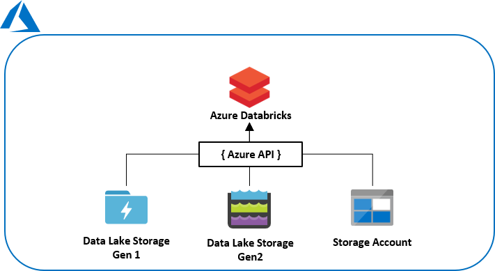

# Computing total storage size of a folder in Azure Data Lake with Pyspark

The following repository give you a Notebook to recursively compute the storage size and the number of files and folder in ADLS Gen 1 (or Azure Storage Account) into Databricks.

If you want a deeper explanation, you can read this [medium's article](https://medium.com/datalex/).