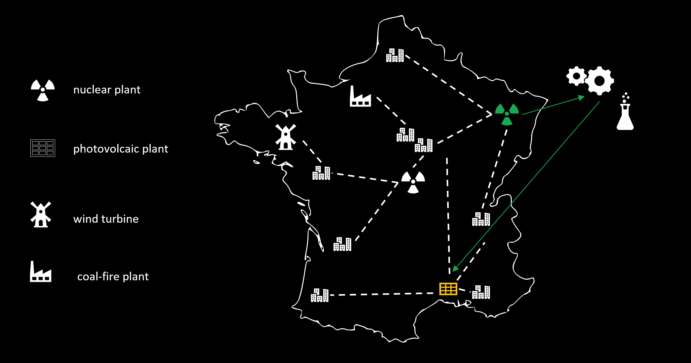
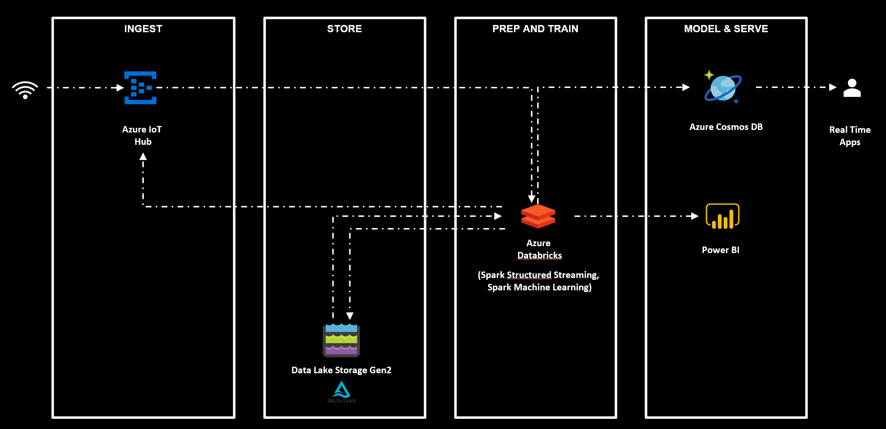

# Databricks Series:

We decided to kick off a series of articles to walk you through the key concepts of Azure Databricks. Our goal is to help you from scratch to deploy your solution in production using Databricks.

We will start by explaining the architecture behind the platform along with the different security aspects that you should know. Then, we will move to the industrialization of Databricks' workflows starting from the CI/CD pipeline, using Ansible and Terraform, to the orchestration of your different jobs. We will also dedicate an article to talk about the best practices to implement in your projects.
Then, we will end the series by implementing together our solution from scratch.

You can find links throught the articles over there:
* [Azure Databricks - Part 1: Introduction](https://medium.com/datalex/azure-databricks-part-1-introduction-40e07de88a09)
* Azure Databricks - Part 2.1: The architecture behind
* Azure Databricks - Part 2.2: Getting familiar with Databricks UI
* Azure Databricks - Part 3: Connect Azure storage to Databricks
* Azure Databricks - Part 4.1: Data protection
* Azure Databricks - Part 4.2: Authentication through Databricks
* Azure Databricks - Part 4.3: Secure your network
* Azure Databricks — Part 5: Monitor your plateforme
* Azure Databricks - Part 6: Configure the development environment
* Azure Databricks - Part 7.1: Integration of Databricks in your CI/CD pipeline
* Azure Databricks - Part 7.2: Schedule your work
* Azure Databricks - Part 8: Stay on top of Databricks best practices
* Azure Databricks - Part 9: Using Databricks in a big company
* Azure Databricks - Part 10: Use case - from ingestion to visualization
* [Azure Databricks - Bonus: Spark AI Summit 2019 Overview](https://medium.com/datalex/spark-ai-summit-2019-overview-b001a546bdef)

Under this repository, you will find several tools, decribe bellow:
* Best practice & usefull Notebook
* ARM & Terraform package for Databricks
* Databricks migration tools

## Use Case:

In order to help you practice everything you will learn, we decided to end our series with the implementation of a concrete AI Enterprise use case.

Today, France has four different power plants: nuclear plant, solar panels, wind turbine and coal-fire plant. One of the biggest challenges faced by this industrial facility is the over-consumption caused by one of the stations.
In order to tackle this challenge we simulate the behavior of these power plants through telemetry devices.
The aim of our solution is to predict and redirect the over-consumption. Whenever this scenario happens, our algorithm will pick beforehand the best candidate to absorb the marginal consumption:

Our power plant information is simulated from weather history, from the last couple of years.

The architecture to be implemented for our use case will be as follows:

You can find the complete code and detail of the use case, in the [following folder](./use-case) [work in progress].
